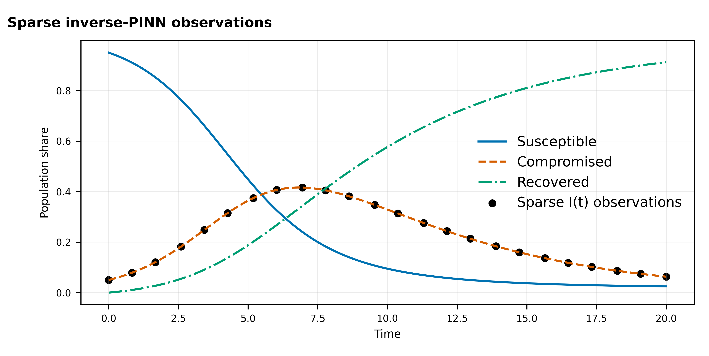
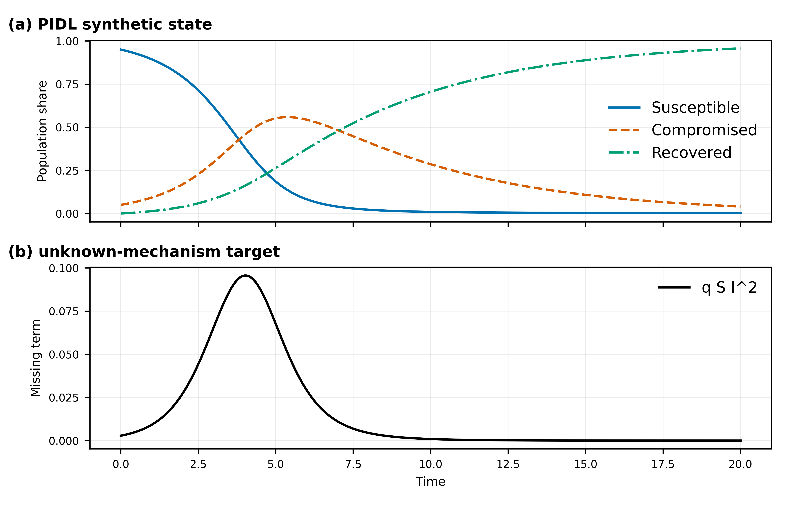
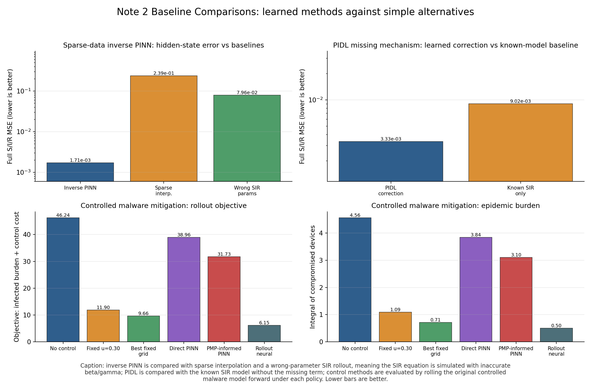

# Physics-Informed Cyber Control

Executable code for PINNs, PIDL, neural optimal control, and PMP-informed residual learning in cyber-control models. This is the third repository in the family. It uses the foundation package `cybercontrol` for shared ODEs, graph SIPS dynamics, Torch helper blocks, integration, plotting, and CSV utilities.

## Repository Family

| Order | Repository | Role |
|---:|---|---|
| 0 | [network-control-differential-games](https://github.com/LYang910920/network-control-differential-games) | Foundation notation, shared `cybercontrol` package, continuous-time, impulse, and continuous-impulsive examples, degree-vs-node scalability, and reference smoke runs. |
| 1 | [note1-cyber-control-games](https://github.com/LYang910920/note1-cyber-control-games) | FBSM baselines, sampled-data MDP conversion, DDQN defense, CTDE, cooperative node-SIPS MAPPO, and larger node-SIPS attacker-defender benchmarks. |
| 2 | `note2-pinn-pidl-cyber-control` | Inverse PINN, PIDL, direct neural control, PMP-informed PINN, and heterogeneous node-SIPS inverse learning. |

## 5-Minute Quick Start

```bash
python -m venv .venv
source .venv/bin/activate
python -m pip install --upgrade pip
python -m pip install -e "../network-control-differential-games[torch,dev]"
python -m pip install -e ".[dev]"
python run_all.py smoke
python run_all.py figures
```

If this repository is cloned without the sibling foundation repo:

```bash
python -m pip install "cybercontrol[torch] @ git+https://github.com/LYang910920/network-control-differential-games.git"
python -m pip install -e ".[dev]"
```

For bounded diagnostics and baseline comparisons:

```bash
python run_all.py train
```

## Code Map

| Need | Start here |
|---|---|
| Tutorial PDF | `docs/note2_pinn_pidl_cyber_control.pdf` |
| Run and implementation guide | `docs/code_run_guide.pdf`, `docs/implementation_companion.pdf` |
| Parameters and neural hyperparameters | `docs/PARAMETERS.md` |
| Paper workflow and extensions | `docs/PAPER_WORKFLOW.md`, `docs/EXTENDING.md` |
| Inverse PINN | `src/inverse_pinn_sir_malware.py` |
| PIDL missing-mechanism example | `src/pidl_unknown_mechanism.py` |
| Neural control and PMP-informed PINN | `src/control_pinn_malware.py`, `src/pmp_informed_pinn_malware.py` |
| Heterogeneous node-SIPS inverse PINN | `src/node_sips_inverse_pinn.py` |
| Static figures and bounded diagnostics | `scripts/generate_figures.py`, `scripts/run_training_iterations.py` |

## Capability Status

| Capability | API / file | Command | Metrics | Validation status |
|---|---|---|---|---|
| Heterogeneous node-SIPS inverse PINN | `src/node_sips_inverse_pinn.py` | `python run_all.py node-inverse --output-csv artifacts/extended_validation/node_inverse.csv` | loss, residual loss, held-out state MSE, held-out-node MSE, mass error | community-specific susceptibility, infectivity, and gamma |
| Sparse/noisy observations | `NodeSIPSInverseConfig` | add `--noise`, `--observed-nodes`, `--observed-times` | data loss, held-out-time/node errors | observes infected probability for selected nodes/times |
| Homogeneous misspecification comparison | `rollout_known_params` | same command | homogeneous-misspecification state MSE | compares heterogeneous truth against global-rate rollout |
| Identifiability limits | `docs/EXTENDING.md`, `docs/PARAMETERS.md` | documentation | rate RMSE and residual checks | claims remain limited to the configured graph/profile |

## Representative Experiments

The inverse PINN starts from sparse infected-state observations and learns hidden state curves plus propagation parameters under ODE residual constraints.



The PIDL example keeps the known SIR mechanism explicit and uses a correction network for the synthetic missing nonlinear term.



The baseline comparison evaluates learned methods against method-specific alternatives. A rollout means the original ODE or graph simulator is run forward under a parameter set or control policy. The graph inverse PINN uses heterogeneous community-specific susceptibility, infectivity, and recovery rather than fitting one global beta/gamma to heterogeneous truth; it also logs a homogeneous-misspecification rollout and held-out-node state error.



## Extension Route

1. Read `docs/PARAMETERS.md` before changing collocation points, width/depth, loss weights, or training length.
2. Pick one method file and preserve the meaning of its logged loss terms.
3. Keep common ODE, Torch, graph, plotting, and CSV helpers in `cybercontrol`; add Note 2 code only for PINN/PIDL method logic.
4. Run `python run_all.py smoke` after each structural change.
5. Use `python run_all.py train` for bounded diagnostics. Outputs go to ignored `artifacts/experiments/` and `artifacts/figures/`.

## Validation

```bash
python -m compileall -q src tests scripts
python -m pytest -q
python run_all.py smoke
python run_all.py figures
```

Extended local diagnostic run:

```bash
python run_all.py train --profile teaching --iters 800 --device cpu --threads 1
python run_all.py node-inverse --device cpu --output-csv artifacts/extended_validation/node_inverse.csv
```

`node-inverse --device auto` uses CUDA when available. On MPS-only machines it
falls back to CPU for this residual-heavy inverse-PINN runner, because current
PyTorch/MPS builds can abort inside the higher-order residual slicing workload.
Use `--device mps` only for backend experiments.

In this run, inverse PINN, PIDL, direct-control PINN, and PMP-informed diagnostics all reduced their tracked losses. The baseline comparison selected the inverse PINN for sparse-data state recovery, PIDL for the missing-mechanism case, and rollout-optimized neural control for the control objective.
The audited node-SIPS inverse run reduced held-out state MSE to about `6.10e-3`, slightly below the matched homogeneous rollout error of about `6.81e-3`; rate recovery remains less identifiable than state recovery in this small time-only network.

GitHub Actions runs the smoke tests on pushes and pull requests. The examples are teaching baselines and need additional seed, noise, identifiability, and uncertainty studies before paper-level claims.

## Citation and License

See `LICENSE` and `NOTICE.md`. When using the repository in a paper or report, cite the related publication and the foundation repository when its shared package is used.
