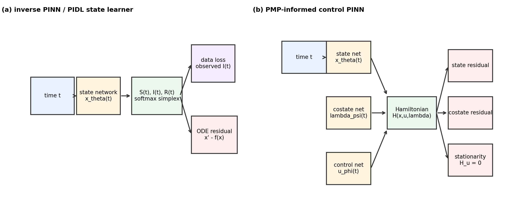
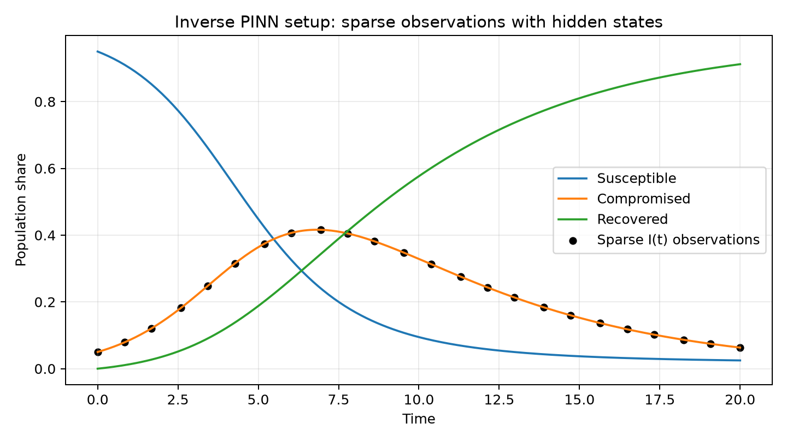
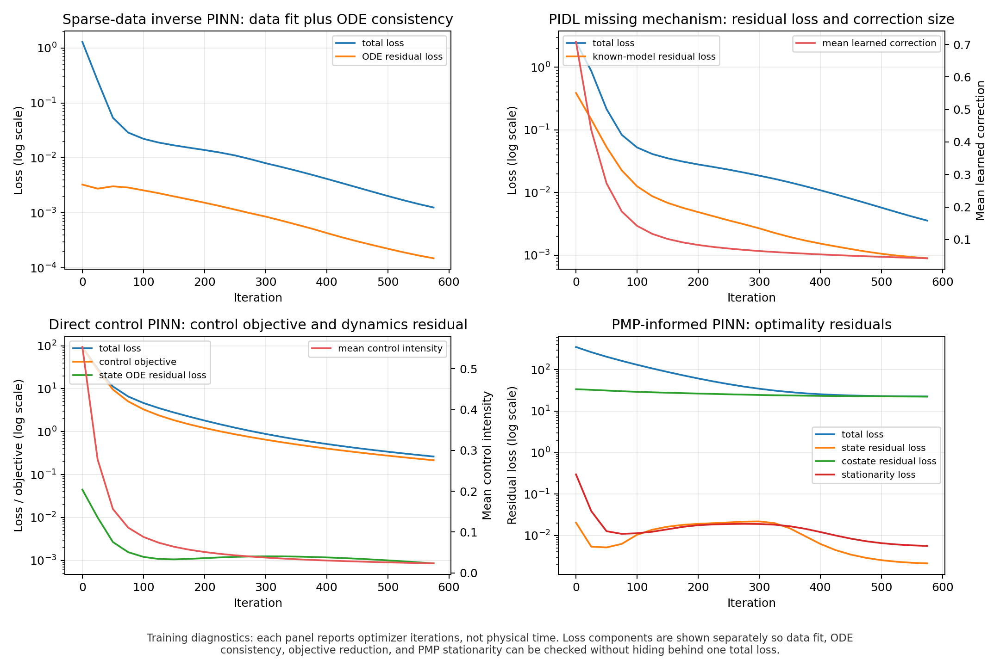
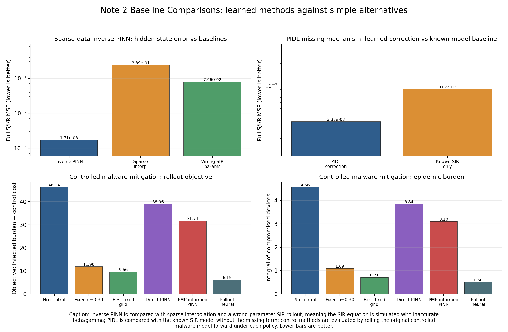

# PINN and PIDL for Cyber Control: Companion Note 2

Executable companion for **Note 2: PINN/PIDL for Cyber Control**. This is the third repository in the tutorial family: it builds on the foundation repository's notation and shared `cybercontrol` package, then focuses on inverse PINNs, PIDL with a missing mechanism, direct neural optimal control, and PMP-informed PINNs.

The main goal is to make the loss design visible: data terms, ODE residuals, boundary conditions, control objectives, and PMP optimality residuals are logged separately.  The examples are compact, but each one produces figures and CSV histories so the training behavior can be inspected rather than guessed.

If this is your first visit, start with `START_HERE.md`.

## Repository Family

The three repositories are meant to be read in order, but each remains runnable on its own.

| Order | Repository | Role |
|---:|---|---|
| 0 | [network-control-differential-games](https://github.com/LYang910920/network-control-differential-games) | **Foundation.** Notation, shared `cybercontrol` package, continuous/impulse/hybrid examples, degree-level versus node-level FBS scalability, and reference smoke runs. |
| 1 | [note1-cyber-control-games](https://github.com/LYang910920/note1-cyber-control-games) | **Companion Note 1.** PMP/FBSM baselines, sampled-data MDP conversion, DDQN defense learning, compact CTDE, and node-SIPRS MAPPO. |
| 2 | `note2-pinn-pidl-cyber-control` | **This companion note.** PINN/PIDL, inverse learning, neural control, PMP-informed residuals, and sparse-data validation. |

## Quick Start

```bash
python -m venv .venv
source .venv/bin/activate
pip install --upgrade pip
pip install -e ../network-control-differential-games
pip install -r requirements.txt
bash scripts/run_smoke_tests.sh
python scripts/generate_figures.py
```

If this repository is cloned by itself, install the shared foundation package from GitHub before running the examples:

```bash
pip install "git+https://github.com/LYang910920/network-control-differential-games.git"
```

For longer diagnostics and baseline comparisons:

```bash
python scripts/run_training_iterations.py
```

## Repository Guide

| Need | Open |
|---|---|
| Short orientation | `START_HERE.md` |
| Tutorial narrative | `docs/note2_pinn_pidl_cyber_control.pdf` |
| Parameter and hyperparameter reference | `docs/PARAMETERS.md` |
| Paper-writing workflow | `docs/PAPER_WORKFLOW.md` |
| Source-code map | `src/README.md` |
| Student extension profiles | `src/experiment_profiles.py` |
| Script and output map | `scripts/README.md` |
| Training curves and CSVs | `experiments/README.md` |
| Extensions and scaling | `docs/EXTENDING.md` |
| License and attribution | `LICENSE`, `NOTICE.md` |

## Core Flow

```text
cyber ODE model
  -> sparse data and residual losses
  -> inverse PINN / PIDL
  -> neural control PINN
  -> PMP-informed optimality residuals
  -> small node-SIPRS graph inverse PINN bridge
```



## What You Learn

| Topic | In this repo |
|---|---|
| Inverse PINNs | Learn hidden trajectories and unknown parameters from sparse observations. |
| PIDL | Keep known cyber dynamics explicit and learn only the missing mechanism. |
| Neural control | Train state and control networks against objectives and ODE residuals. |
| PMP-informed PINNs | Use Hamiltonian residuals to connect neural training with optimal-control theory. |
| Graph/node inverse learning | Use the shared SIPRS simulator to create sparse node observations and held-out graph-state metrics. |

## Representative Experiments

The inverse PINN example starts from sparse infected-state observations and learns hidden state curves plus propagation parameters under ODE residual constraints.



The PIDL example keeps the known SIR mechanism in the model and asks a correction network to recover a synthetic missing nonlinear term.


The training diagnostics plot compares the longer tutorial runs for inverse PINN, PIDL, direct-control PINN, and PMP-informed PINN.  The separate loss curves make it easier to see whether the model is fitting data, respecting dynamics, and reducing the intended objective.



The baseline comparison plot asks a second question: after training, how do the learned methods compare with simple alternatives?  It uses method-specific baselines: sparse interpolation and a wrong-parameter SIR rollout for inverse PINNs, known-SIR-only dynamics for PIDL, and no/fixed/learned controls for malware mitigation.  A **rollout** means the original ODE or graph simulator is run forward under a parameter set or control policy; it is a validation check, not just another training loss.



## Main Outputs

| Output | Purpose |
|---|---|
| `figures/inverse_pinn_sparse_data.png` | sparse-observation inverse-learning setup |
| `figures/pidl_missing_mechanism.png` | known dynamics plus learned missing mechanism |
| `figures/training_iteration_diagnostics.png` | longer inverse PINN, PIDL, control PINN, and PMP-informed diagnostics |
| `figures/baseline_comparison.png` | learned methods compared with method-specific baselines |
| `experiments/node_siprs_inverse_pinn_smoke.csv` | small node-SIPRS inverse PINN smoke metrics with held-out state error |
| `experiments/OUTPUT_PREVIEW.md` | categorized first-stop summary after longer experiment runs |
| `experiments/baseline_comparison_metrics.csv` | exact metric values behind the baseline comparison plot |
| `experiments/*.csv` | logged histories behind the training plot |

## Validation

`bash scripts/run_smoke_tests.sh` runs the fast local check.  GitHub Actions repeats the smoke tests and regenerates figures on each push or pull request.

These tutorial examples are not calibrated cyber-risk models.  For research use, add noisy-data studies, identifiability checks, multiple seeds, held-out trajectories, and uncertainty estimates.

Before changing losses, collocation points, network width, or training iterations, read `docs/PARAMETERS.md`; it also defines trajectory, rollout, wrong-parameter rollout, baseline, and robustness. To adapt the code to a paper-specific model, start with `python src/experiment_profiles.py`.  It lists each method, the loss terms to preserve, the first functions to edit, and the bridge toward larger network or cyber-control scenarios. For paper structure and baseline planning, read `docs/PAPER_WORKFLOW.md`.

For a heavier local/GPU diagnostic after the smoke tests pass, use:

```bash
python scripts/run_training_iterations.py --profile gpu
```

The reusable numerical/model helpers are imported from the foundation package `cybercontrol`, especially the Torch SIR RHS, node-level SIPRS graph equations, bounded control networks, simplex state networks, positive parameter transforms, autograd time derivatives, RK4 data generation, plotting helpers, and CSV writing.

## Related Tutorial Repositories

| Repository | Use it for |
|---|---|
| https://github.com/LYang910920/network-control-differential-games | Start here for the foundation notation, shared package, and worked optimal-control/game examples. |
| https://github.com/LYang910920/note1-cyber-control-games | Continue through PMP/FBSM baselines, ODE-RL, DDQN, compact CTDE, and node-SIPRS MAPPO before this PINN/PIDL branch. |

## License And Copyright

Released under the MIT License.  See `LICENSE` for terms and `NOTICE.md` for copyright, dependency, and attribution notes.
