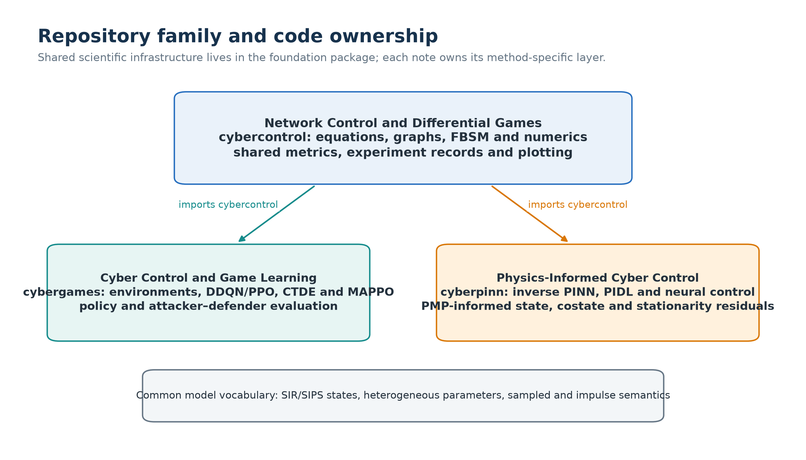
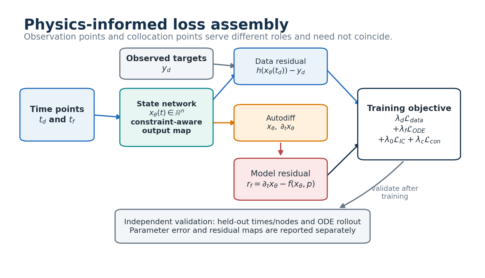
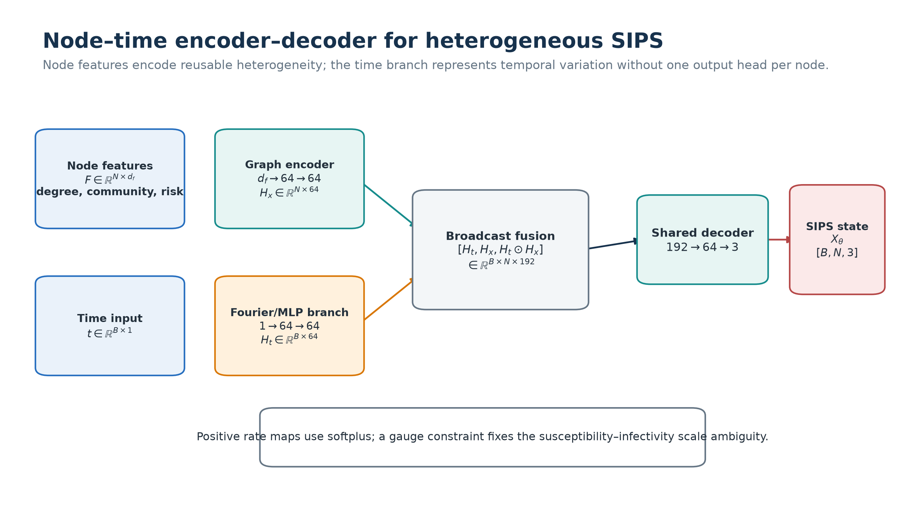
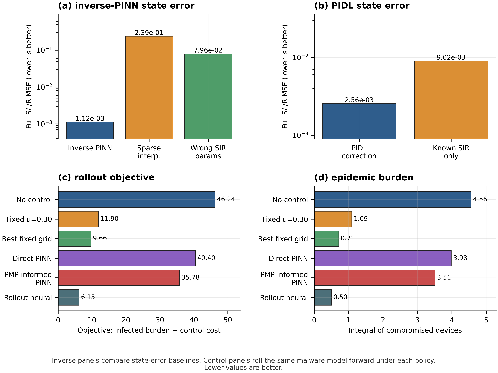

# Physics-Informed Cyber Control

Executable material for inverse PINN, PIDL, direct neural control,
PMP-informed learning and heterogeneous node-SIPS inference. Shared ODE/SIPS
equations, graph operations, neural blocks, devices, metrics and plotting come
from the foundation package `cybercontrol`.

The examples are synthetic research templates. A small residual is not evidence
of parameter identifiability, global optimality or deployment safety.

## Repository Family



| Order | Repository | Responsibility |
|---:|---|---|
| 0 | [Network Control and Differential Games](https://github.com/LYang910920/network-control-differential-games) | Shared equations, heterogeneity, graphs, numerics, FBSM, neural blocks and plotting |
| 1 | [Cyber Control and Game Learning](https://github.com/LYang910920/note1-cyber-control-games) | Environments, DDQN/PPO, CTDE, MAPPO and game evaluation |
| 2 | **Physics-Informed Cyber Control** | Inverse PINN, PIDL, neural control and PMP-informed learning |

## 5-Minute Quick Start

Python 3.10 or newer is required. With sibling checkouts:

```bash
python -m venv .venv
source .venv/bin/activate
python -m pip install --upgrade pip
python -m pip install -e "../network-control-differential-games[torch]"
python -m pip install -e ".[dev]" --no-deps
python -m cyberpinn smoke
python -m pytest -q
```

After the foundation `0.2.0` changes are on `main`, a standalone checkout can
use `python -m pip install -e ".[dev]"`.

```bash
python -m cyberpinn medium --device auto --output-dir artifacts/medium
python -m cyberpinn figures
python -m cyberpinn docs
python -m cyberpinn all
```

## Code Map

| Need | Start here |
|---|---|
| Main PDF | [`docs/note2_pinn_pidl_cyber_control.pdf`](docs/note2_pinn_pidl_cyber_control.pdf) |
| Tasks, losses and architectures | [`docs/METHODS_AND_API.md`](docs/METHODS_AND_API.md) |
| Commands and experiment record | [`docs/REPRODUCIBILITY.md`](docs/REPRODUCIBILITY.md) |
| Paper workflow | [`docs/FROM_MODEL_TO_PAPER.md`](docs/FROM_MODEL_TO_PAPER.md) |
| Public package | [`src/cyberpinn/`](src/cyberpinn/) |
| Inverse PINN and PIDL | [`inverse.py`](src/cyberpinn/inverse.py), [`pidl.py`](src/cyberpinn/pidl.py) |
| Neural control | [`control.py`](src/cyberpinn/control.py), [`pmp.py`](src/cyberpinn/pmp.py) |
| Heterogeneous SIPS data problem | [`src/cyberpinn/node_problem.py`](src/cyberpinn/node_problem.py) |
| Heterogeneous node inverse | [`src/cyberpinn/node_inverse.py`](src/cyberpinn/node_inverse.py) |
| Typed hyperparameters | [`src/cyberpinn/configs.py`](src/cyberpinn/configs.py) |
| Shared architectures | [`src/cyberpinn/architectures.py`](src/cyberpinn/architectures.py), `cybercontrol.nn` |
| Literature evidence | [`docs/literature/literature_matrix.csv`](docs/literature/literature_matrix.csv) |

## Representative Experiments

The inverse PINN separates sparse observations from collocation points and
evaluates hidden states and parameters against an independent ODE solution.



The heterogeneous SIPS estimator compares dense and factorized node-time
architectures at a matched parameter budget. It reports held-out times,
unobserved nodes, an unseen node count and a homogeneous misspecification
baseline.



The aggregate experiment suite compares inverse PINN, PIDL, direct neural
control and PMP-informed residual learning using method-specific diagnostics.
Training losses are not compared as if their scales were interchangeable.



The node inverse model fixes the susceptibility-infectivity scale gauge and
reports effective transmission-matrix error. State recovery may be accurate even
when individual rates remain weakly identifiable.

## Extension Route

1. Define observations, unknowns and identifiability before building a network.
2. Reserve held-out times, nodes, trajectories or graphs before training.
3. Compare homogeneous misspecification and classical/known-mechanism baselines.
4. Log each loss component and evaluate an independent simulator rollout.
5. Sweep noise, sparsity, heterogeneity, graph and architecture choices.
6. Keep shared equations and neural blocks in `cybercontrol`.

The [methods guide](docs/METHODS_AND_API.md) lists exact defaults, tensor shapes,
gauge semantics and the old-to-new import map.

## Validation

```bash
python -m compileall -q src tests scripts
python -m ruff check src tests scripts
python -m pytest -q
python -m cyberpinn smoke
python -m cyberpinn figures
python -m cyberpinn docs
```

The three-seed noise/sparsity/architecture profile is documented in
[`docs/REPRODUCIBILITY.md`](docs/REPRODUCIBILITY.md).

## Citation and License

Code, documentation and generated figures are MIT-licensed unless a file says
otherwise. See [`LICENSE`](LICENSE) and [`NOTICE.md`](NOTICE.md). Cite the
foundation repository when using `cybercontrol` and cite the relevant method
source recorded in `docs/literature/`.
