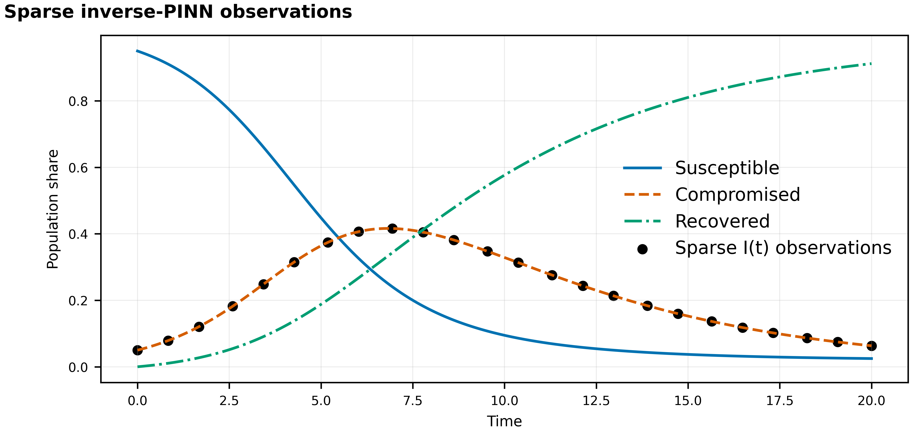
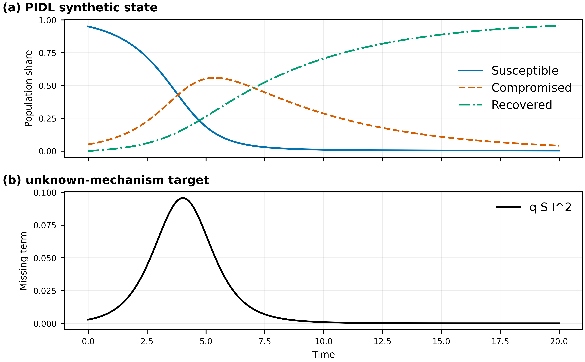

# Physics-Informed Cyber Control

Inverse PINN, physics-informed deep learning, neural control, and PMP-informed
methods for cyber-dynamics models. Shared ODEs, graph SIPS equations, integration,
neural blocks, metrics, and plotting come from the Foundation `cybercontrol`
package.

## Repository Family

| Repository | Purpose |
|---|---|
| [Network Control and Differential Games](https://github.com/LYang910920/network-control-differential-games) | Foundation equations, FBS solvers, heterogeneous profiles, and shared Python components. |
| [Cyber Control and Game Learning](https://github.com/LYang910920/note1-cyber-control-games) | Sampled environments, DDQN, CTDE, MAPPO, and game evaluation. |
| **Physics-Informed Cyber Control** | Inverse PINN, PIDL, neural control, and PMP-informed learning. |

## Five-Minute Start

With the Foundation repository next to this checkout:

```bash
python -m venv .venv
source .venv/bin/activate
python -m pip install --upgrade pip
python -m pip install -e "../network-control-differential-games[torch]"
python -m pip install -e ".[dev]"
python -m cyberpinn smoke
```

For a standalone checkout, `python -m pip install -e ".[dev]"` installs the
Foundation revision declared in `pyproject.toml`.

```bash
python -m cyberpinn medium --device auto --output-dir artifacts/medium
python -m cyberpinn figures
python -m cyberpinn docs
```

`medium` runs bounded three-seed aggregate and node-SIPS studies with noise,
observation sparsity, held-out nodes/times, and dense/factorized architectures.

## Code Map

| Topic | Module |
|---|---|
| Typed model and training settings | `cyberpinn.configs` |
| Dense and factorized state networks | `cyberpinn.architectures` |
| Aggregate inverse PINN | `cyberpinn.inverse` |
| PIDL missing-mechanism model | `cyberpinn.pidl` |
| Direct neural control | `cyberpinn.control` |
| PMP-informed state/costate learning | `cyberpinn.pmp` |
| Heterogeneous node-SIPS truth | `cyberpinn.node_problem` |
| Node-SIPS inverse training and transfer | `cyberpinn.node_inverse` |
| Held-out masks and result metrics | `cyberpinn.evaluation` |
| Bounded multi-seed experiment profile | `cyberpinn.experiments` |

The public entry point is `python -m cyberpinn`. `run_all.py` remains a small
compatibility shim; it contains no model or training implementation.

## Representative Experiments

Sparse inverse data observe the compromised component at selected times. Hidden
state trajectories and parameters are constrained by the SIR residual and initial
condition, then assessed on held-out points.



The PIDL example preserves the known SIR mechanism and learns a regularized
correction for a synthetic missing term. Its ablation compares the correction
model with the known-mechanism baseline.



For heterogeneous node-SIPS truth, the inverse model estimates community-specific
or feature-conditioned rates. It also evaluates a homogeneous misspecification
baseline; fitting one global rate pair is not presented as recovery of the
heterogeneous truth.

## Extension Route

1. Validate the ODE and observation map with a numerical solver before training.
2. Declare observed states, collocation points, unknown parameters, and positivity constraints.
3. Change typed configurations in `cyberpinn.configs`; avoid literals in loss loops.
4. Track each loss component and evaluate states, parameters, residuals, and conservation separately.
5. Test noise, sparsity, held-out nodes/times, graph transfer, and homogeneous misspecification.

See [Methods and API](docs/METHODS_AND_API.md),
[Reproducibility](docs/REPRODUCIBILITY.md), and
[From Model to Paper](docs/FROM_MODEL_TO_PAPER.md).

## Validation

```bash
python -m compileall -q src tests scripts
ruff check .
ruff format --check src tests scripts
pytest -q
python -m cyberpinn smoke
python -m cyberpinn figures
```

Residual consistency does not establish parameter identifiability. The examples
are controlled synthetic studies, not calibrated cyber-risk models. See
[LICENSE](LICENSE), [NOTICE.md](NOTICE.md), and the
[tutorial PDF](docs/note2_pinn_pidl_cyber_control.pdf).
