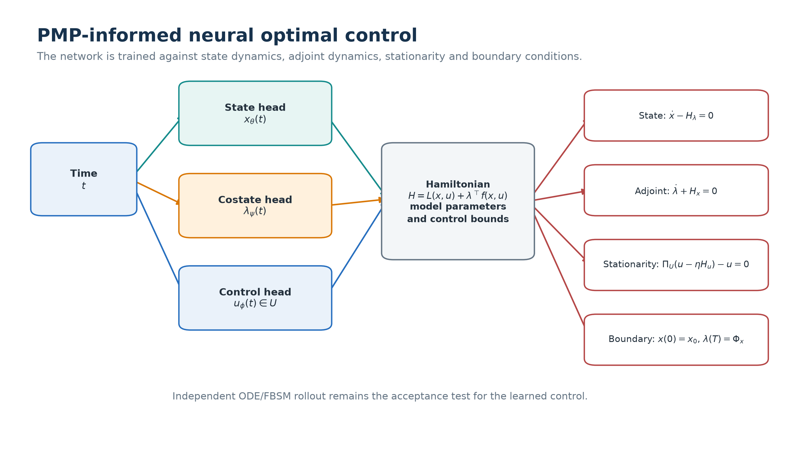

# Methods and Public API

Note 2 owns inverse PINN, PIDL, direct neural control and PMP-informed neural
methods. It imports SIR/SIPS equations, graph operations, integration, neural
blocks, device selection, metrics and plotting from `cybercontrol`.

## Task taxonomy

| Task | Known | Learned | Required validation |
|---|---|---|---|
| forward PINN | equations and parameters | state trajectory | numerical ODE solution and residual map |
| inverse PINN | equations; partial observations | hidden states and parameters | held-out data, parameter/effective-rate error |
| PIDL | known mechanism plus missing term class | state and correction | known-only ablation and correction regularity |
| direct neural control | equations and objective | bounded control and state | independent simulator rollout and classical baseline |
| PMP-informed PINN | Hamiltonian system | state, costate and control | state/adjoint/stationarity/boundary residuals plus rollout |

Residual consistency does not imply parameter identifiability, optimality or
closed-loop stability.


## Data and collocation points

Observation points constrain measured components. Collocation points enforce
the differential equation and may include unobserved times and nodes. Training
and held-out masks are saved separately. Noise is projected back to the state
simplex so a synthetic noisy SIPS observation remains nonnegative and
mass-conserving.

The aggregate examples use SIR state `[S, I, R]`. The heterogeneous graph
inverse problem uses SIPS `[S_i, I_i, P_i]` and the canonical node pressure

```text
lambda_i = susceptibility_i * sum_j A_ij * infectivity_j * I_j.
```

The canonical graph model uses the three-compartment state `[S, I, P]`.

## Aggregate method configurations

All settings are typed dataclasses in `cyberpinn.configs`.

| Method | Default training | Architecture | Main weights |
|---|---|---|---|
| inverse PINN | 5,000 iterations; 30 data; 200 collocation | width 64, depth 4 | IC 10, ODE 1 |
| PIDL | 5,000 iterations; 40 data; 200 collocation | width 64, depth 2 | IC 10, residual 1, correction `1e-3` |
| direct control | horizon 20; 200 collocation; 5,000 iterations | state/control networks, width 64 | residual 10, IC 10 |
| PMP-informed | horizon 20; 200 collocation; 5,000 iterations | state/costate/control heads, width 64 | state 10, costate 1, stationarity 1, BC 10 |

The medium runner uses 150 iterations and width 24 for aggregate diagnostics.
The paired node study uses 300 iterations for each architecture, noise level and
observation regime. These remain bounded comparative runs, not converged paper
hyperparameters.



## Heterogeneous node-SIPS inverse model

The synthetic truth uses node-specific susceptibility, infectivity and recovery,
with known graph, patch, cleaning and waning terms. It does not fit one global
`beta/gamma` pair to heterogeneous truth.

Two estimators are compared at a matched parameter budget:

- `dense`: a time network with a joint node-state output;
- `factorized`: node features and a time branch are fused, then passed through a
  shared three-state decoder. Fourier time features remain an optional shared
  architecture setting but are not used for the smooth SIPS comparison.

The two builders use the shared `cybercontrol.nn` architecture registry. The
experiment record includes input/output shapes, activation, normalization,
encoder, pooling, decoder and state-network parameter count in addition to the
matched dense target.


Susceptibility and infectivity appear multiplicatively. Their individual scales
are therefore not identifiable without a gauge. The estimator fixes the
geometric mean of infectivity to one and reports both parameter RMSE and the
effective transmission-matrix error
`beta * susceptibility[:, None] * A * infectivity[None, :]`.

Evaluation includes held-out times, entirely unobserved nodes, a matched
homogeneous misspecification rollout and transfer of the factorized model to an
unseen node count. Claims remain limited to the configured synthetic graph and
observation model.

Default node inverse settings are 8 nodes, 2 communities, horizon 6, 61 time
points, 4 observed nodes, 14 observed times, 32 collocation points, 500
iterations, width 32, depth 2 and heterogeneity strength 0.35.

## Public modules and migration

| Responsibility | Current module | Previous flat path |
|---|---|---|
| inverse SIR PINN | `cyberpinn.inverse` | `inverse_pinn_sir_malware.py` |
| PIDL correction | `cyberpinn.pidl` | `pidl_unknown_mechanism.py` |
| direct neural control | `cyberpinn.control` | `control_pinn_malware.py` |
| PMP-informed method | `cyberpinn.pmp` | `pmp_informed_pinn_malware.py` |
| heterogeneous SIPS data problem | `cyberpinn.node_problem` | `node_sips_inverse_pinn.py` |
| heterogeneous node inverse | `cyberpinn.node_inverse` | `node_sips_inverse_pinn.py` |
| architectures | `cyberpinn.architectures` and `cybercontrol.nn` | local network definitions |
| typed profiles | `cyberpinn.configs`, `cyberpinn.profiles` | `experiment_profiles.py` |

Use `python -m cyberpinn` or the `cyberpinn` console script. `run_all.py` is a
small deprecation entry point.
